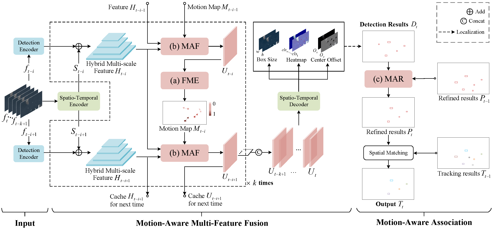

# FMA-Net: Flow-driven Motion-Aware Network for Multi-Object Tracking in Satellite Videos

This repository provides the official code for the paper:

**[FMA-Net: Flow-driven Motion-Aware Network for Multi-Object Tracking in Satellite Videos](https://ieeexplore.ieee.org/document/11214536)**  
*IEEE Transactions on Geoscience and Remote Sensing (TGRS), 2025*

---

## 🎯 Key idea

FMA-Net introduces a **motion-sensitive tracking paradigm** tailored for satellite video.  
The framework consists of:

| Component | Role |
|----------|------|
| **FME** | Estimates pixel-level motion cues to perceive fine-grained dynamic patterns |
| **MAF** | Aggregates multi-frame features guided by motion sensitivity |
| **MAR** | Refines association and preserves identity continuity |

Experiments on **SatVideoDT** and **SatMTB** confirm that FMA-Net establishes **state-of-the-art performance** across tracking metrics.

---

## 🏛️ Architecture

<div align="center">
  
</div>

---

## 📦 Installation

### Environment
- Python 3.8
- PyTorch 1.11.0
- CUDA 11.3

### Dependencies
```bash
pip install -r requirements.txt
```

### MMCV + MMDetection

```bash
pip install -U openmim
pip install mmcv-full==1.7.0 -f https://download.openmmlab.com/mmcv/dist/cu116/torch1.12/index.html
pip install mmdet==2.25.1
```

### COCOAPI (required）
```bash
# COCOAPI=/path/to/clone/cocoapi
git clone https://github.com/cocodataset/cocoapi.git $COCOAPI
cd $COCOAPI/PythonAPI
make
python setup.py install --user
```
### DCNv2 (required）

```bash
cd lib/models
git clone https://github.com/lucasjinreal/DCNv2_latest.git
cd DCNv2_latest
python setup.py build develop
```
---

## 📂 Trained Models and Dataset Annotations

To facilitate reproduction of our results, we provide:

- **Trained model weights** for both SatVideoDT and SatMTB datasets.
- **Dataset JSON annotations** (COCO format) corresponding to benchmark splits.
- **Raw tracking output results** generated by FMA-Net.

All files can be downloaded from **[Google drive](https://drive.google.com/drive/folders/1WuYvJESiPTv6FcYtFPmT2Ipfq7MKyg9m?usp=drive_link)**  


## 🚀 Training

### SatMTB

```bash
python train_satmtb.py 
    --model_name DLADCN --gpus 0,1 
    --lr 1.25e-4 --num_epochs 30 --batch_size 4 
    --seqLen 5 --num_classes 3 
    --datasetname SatMTB --data_dir ./data/SatMTB/ 
    --warmup_iters 19512
```

### SatVideoDT

```bash
python train_satvideoDT.py 
    --model_name DLADCN --gpus 0,1 
    --lr 1.25e-4 --lr_step 14,19 
    --num_epochs 20 --batch_size 4 --seqLen 5 
    --datasetname ICPR --data_dir ./data/ICPR/
```

---

## 🔍 Inference

### SatVideoDT

```bash
python test_satvideoDT.py 
    --model_name DLADCN --gpus 0 
    --load_model ./checkpoints/SatvideoDT.pth 
    --datasetname ICPR --data_dir ./data/ICPR/ 
    --seqLen 5 --conf_thres 0.2
```

### SatMTB

```bash
python test_satmtb.py 
    --model_name DLADCN --gpus 4 
    --load_model ./checkpoints/Satmtb.pth 
    --datasetname SatMTB --data_dir ./data/SatMTB/ 
    --seqLen 5 --num_classes 3 --conf_thres 0.2
```

---

## 📈 Evaluation

```bash
pip install motmetrics
```

Then replace the default parser:

```bash
cp ./motmetrics_io/io.py <python_env>/site-packages/motmetrics/io.py
```

Run evaluation:

```bash
python eval_satvideoDT.py
python eval_satmtb.py
```

---

## 🙏 Acknowledgements

We sincerely appreciate the contributions of the following open-source projects:

* [MP2Net](https://github.com/DonDominic/MP2Net)
* [CenterNet](https://github.com/xingyizhou/CenterNet)

---

## 📝 Citation
If our paper or code proves useful to your work, we would greatly appreciate your citation and a star for this repository.
```bibtex
@ARTICLE{11214536,
  author={Lu, Weiqing and Sun, Bin and Li, Shutao and Li, Xiliang},
  journal={IEEE Transactions on Geoscience and Remote Sensing}, 
  title={FMA-Net: Flow-Driven Motion-Aware Network for Multiobject Tracking in Satellite Videos}, 
  year={2025},
  volume={63},
  pages={1-15},
  doi={10.1109/TGRS.2025.3624205}}
```

